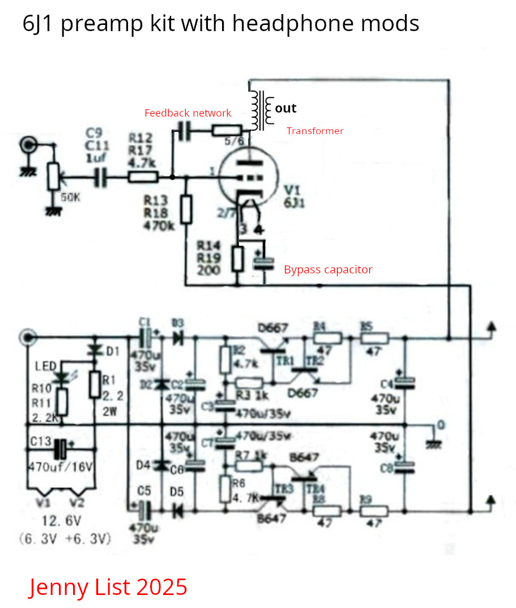

#Mods for 6J1 preamp kits to drive headphones.

Jenny List 2025
CC-BY-SA 4.0

##About
For about $10 you can buy a little tube preamp kit on AliExpress, with a pair of 6J1 pentodes. It's fun but not much use. Here's where I'm trying to make it more useful.

##Headphone amp
The output from the amp is far too high impedance to drive headphones, it needs a modification to drive a lower impedance. There are two ways to do this, a transformer, or a MOSFET source follower. 

The transformer circuit is here, it works but it isn't perfect. Bypass capacitor is 22uf, feedbck network is 220k and 22nf. Transformer is one of the little red transistor audio output transformers, Eagle LT700 clone. The result is listenable, but bass performance isn't as good as it should be because the transformer isn't great.

##Perfboard support
The OpenSCAD files in this repository are for a 3D printable shelf to support a perfboard above the rear connectors. This provides space for the extra circuitry needed.
